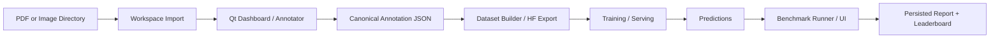

# Architecture Guide

## System Overview

FineTree is organized around a page-annotation and evaluation loop:

1. ingest PDF pages into a managed workspace
2. annotate or auto-generate page facts
3. save canonical JSON
4. convert approved pages into training datasets
5. run or serve models
6. benchmark predictions against ground truth

## Data Flow

## Primary Boundaries

### UI

- [app.py](/Users/delmedigo/Dev/FineTree/src/finetree_annotator/app.py): the annotation window, graphics scene, editors, and AI integration hooks
- [dashboard.py](/Users/delmedigo/Dev/FineTree/src/finetree_annotator/dashboard.py): workspace browser, import flows, embedded annotator host, push pipeline shell
- [ui_theme.py](/Users/delmedigo/Dev/FineTree/src/finetree_annotator/ui_theme.py): shared theme and Qt styling

### Core Annotation Logic

- [annotation_core.py](/Users/delmedigo/Dev/FineTree/src/finetree_annotator/annotation_core.py): page state, payload construction, entity propagation, serialization
- [workspace.py](/Users/delmedigo/Dev/FineTree/src/finetree_annotator/workspace.py): managed paths, PDF image extraction, workspace discovery, document summaries
- [page_issues.py](/Users/delmedigo/Dev/FineTree/src/finetree_annotator/page_issues.py): warnings and regulatory issue summaries
- [equation_integrity.py](/Users/delmedigo/Dev/FineTree/src/finetree_annotator/equation_integrity.py): equation validation and repairs

### Schema And Normalization

- [schemas.py](/Users/delmedigo/Dev/FineTree/src/finetree_annotator/schemas.py): canonical Pydantic models
- [schema_contract.py](/Users/delmedigo/Dev/FineTree/src/finetree_annotator/schema_contract.py): prompt contract and allowed schema keys
- [schema_io.py](/Users/delmedigo/Dev/FineTree/src/finetree_annotator/schema_io.py): canonicalization, migration checks, save guards
- [fact_normalization.py](/Users/delmedigo/Dev/FineTree/src/finetree_annotator/fact_normalization.py): field normalization
- [fact_ordering.py](/Users/delmedigo/Dev/FineTree/src/finetree_annotator/fact_ordering.py): reading direction and fact ordering

### AI And Inference

- [ai/controller.py](/Users/delmedigo/Dev/FineTree/src/finetree_annotator/ai/controller.py): UI workflow orchestration for provider actions
- [provider_workers.py](/Users/delmedigo/Dev/FineTree/src/finetree_annotator/provider_workers.py): threaded Qt workers for Gemini/Qwen actions
- [gemini_vlm.py](/Users/delmedigo/Dev/FineTree/src/finetree_annotator/gemini_vlm.py): Gemini request construction, streaming parsing, bbox restoration, logging
- [qwen_vlm.py](/Users/delmedigo/Dev/FineTree/src/finetree_annotator/qwen_vlm.py): local and endpoint-backed Qwen inference

### Training And Dataset Pipeline

- [finetune/config.py](/Users/delmedigo/Dev/FineTree/src/finetree_annotator/finetune/config.py): validated fine-tune config
- [finetune/dataset_builder.py](/Users/delmedigo/Dev/FineTree/src/finetree_annotator/finetune/dataset_builder.py): train/validation JSONL build
- [finetune/push_dataset_hub.py](/Users/delmedigo/Dev/FineTree/src/finetree_annotator/finetune/push_dataset_hub.py): export and push path with bbox-preserving data
- [finetune/push_dataset_hub_no_bbox.py](/Users/delmedigo/Dev/FineTree/src/finetree_annotator/finetune/push_dataset_hub_no_bbox.py): bbox-stripped export flow
- [finetune/trainer_unsloth.py](/Users/delmedigo/Dev/FineTree/src/finetree_annotator/finetune/trainer_unsloth.py): training entrypoint

### Serving And Deployment

- [deploy/pod_api.py](/Users/delmedigo/Dev/FineTree/src/finetree_annotator/deploy/pod_api.py): FastAPI inference endpoint
- [deploy/simple_infer_api.py](/Users/delmedigo/Dev/FineTree/src/finetree_annotator/deploy/simple_infer_api.py): simple inference API
- [deploy/pod_gradio.py](/Users/delmedigo/Dev/FineTree/src/finetree_annotator/deploy/pod_gradio.py): playground UI
- [deploy/runpod_serverless_worker.py](/Users/delmedigo/Dev/FineTree/src/finetree_annotator/deploy/runpod_serverless_worker.py): RunPod serverless worker

### Benchmark

- [benchmark/config.py](/Users/delmedigo/Dev/FineTree/src/finetree_annotator/benchmark/config.py): config validation
- [benchmark/scoring.py](/Users/delmedigo/Dev/FineTree/src/finetree_annotator/benchmark/scoring.py): scoring logic
- [benchmark/runner.py](/Users/delmedigo/Dev/FineTree/src/finetree_annotator/benchmark/runner.py): headless submission evaluation
- [benchmark/web.py](/Users/delmedigo/Dev/FineTree/src/finetree_annotator/benchmark/web.py): FastAPI benchmark UI

## Design Decisions

### Canonical JSON Is The Stable Contract

Everything converges on canonical page/document JSON before dataset build, benchmark scoring, or export. This reduces drift between UI edits, provider-generated outputs, and training data.

### Managed Workspace Over Ad Hoc File Selection

The dashboard treats `data/raw_pdfs`, `data/pdf_images`, and `data/annotations` as a coherent workspace so document progress, approval state, and benchmark-ready assets can be tracked consistently.

### Long-Running UI Work Uses Worker Objects

Import and provider actions are designed to run through `QObject` workers on `QThread`. This keeps the dashboard responsive and is the intended pattern for any future network, PDF, or export task.

### Providers Emit Logged Sessions

Gemini and Qwen flows both persist request and response artifacts. This makes debugging model behavior easier, but it also means log growth must be treated as output management, not source history.

## Current Architectural Risks

- [app.py](/Users/delmedigo/Dev/FineTree/src/finetree_annotator/app.py) is still far too large and mixes scene logic, editor wiring, save behavior, AI callbacks, and business rules.
- [dashboard.py](/Users/delmedigo/Dev/FineTree/src/finetree_annotator/dashboard.py), [gemini_vlm.py](/Users/delmedigo/Dev/FineTree/src/finetree_annotator/gemini_vlm.py), and [qwen_vlm.py](/Users/delmedigo/Dev/FineTree/src/finetree_annotator/qwen_vlm.py) are also oversized and should be split by responsibility.
- The repository still tracks large generated directories, which obscures the true architectural surface.
- The dataset export path is split between bbox and no-bbox variants with substantial overlap.

## Recommended Decomposition Path

1. Split annotator code into document model, scene tools, editor panels, and persistence modules.
2. Extract provider logging and transport layers from provider-specific parsing logic.
3. Merge dataset push variants under one export pipeline with policy flags.
4. Move generated assets and benchmark outputs out of tracked source paths.
