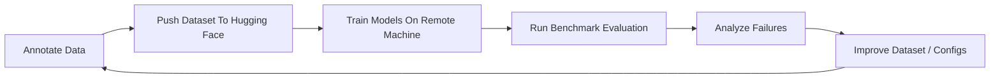
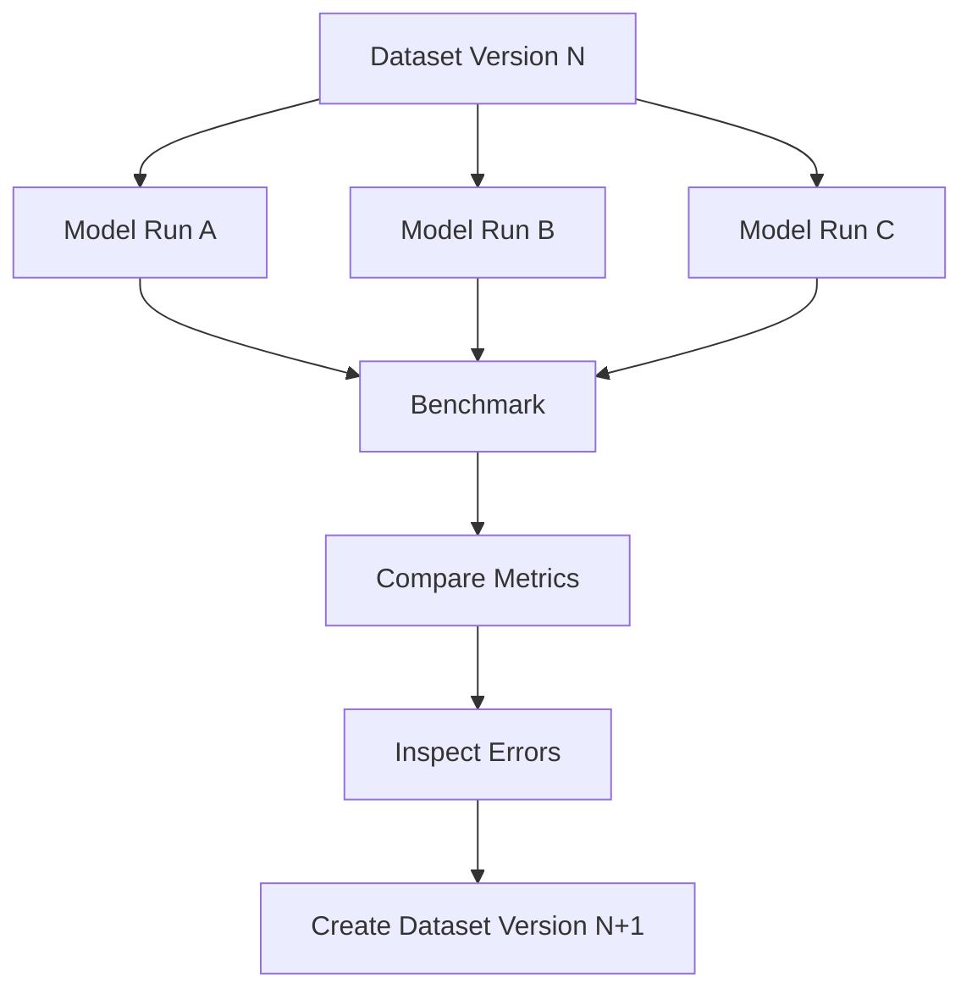
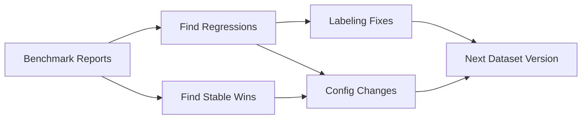

# FineTree Development Workflow

FineTree is a dataset-centric iterative system for improving financial-document extraction models.

The project does not treat training as a one-time step. The main loop is:

`annotate → publish dataset → train models → benchmark → analyze → repeat`

The benchmark step is what makes the loop comparable over time. It allows many model runs to be evaluated against the same dataset version, so changes in model quality can be compared against a shared benchmark instead of anecdotal examples.

## Core Loop

At a high level, FineTree development works like this:

1. Annotate data
2. Push the dataset to Hugging Face
3. Train one or more models on a remote machine
4. Run benchmark evaluation
5. Analyze failures
6. Improve dataset and configs
7. Repeat

## Dataset-Centric Iteration

The dataset version is a key unit of progress in FineTree.

Typical iteration looks like this:

- annotate or fix labels
- publish a new dataset version
- train candidate model runs against that version
- benchmark all of them on the same evaluation setup
- inspect failure patterns
- decide whether the next improvement should come from data changes, prompt/config changes, or model selection

This means the dataset is not only training input. It is also the basis for structured comparison across iterations.

## Training And Comparison

Sometimes multiple models are trained for the same dataset version.

This is useful when comparing:

- different base models
- different LoRA or tuning settings
- different training hyperparameters
- different inference or export choices

In those cases, the benchmark should compare all candidate models against the same dataset version and the same evaluation mappings. That makes it possible to answer questions like:

- did the new dataset version help all models or only one
- is one checkpoint clearly better than another
- are gains coming from better data or just a different training configuration

## Failure Analysis

Benchmark results are not the end of the loop. They feed the next dataset and configuration decisions.

Common analysis questions include:

- which document or page types still fail
- whether title, entity, and other metadata fields regress
- whether fact extraction counts drift up or down
- whether one model is stronger on some subsets but weaker overall

## Practical Summary

The FineTree workflow is best understood as an iterative development loop:

1. improve annotations
2. publish the dataset
3. train one or more candidate models remotely
4. benchmark them on the same dataset version
5. analyze what failed
6. feed those findings back into the next dataset or training iteration

That repeatable loop is the mechanism for improving extraction quality over time.
